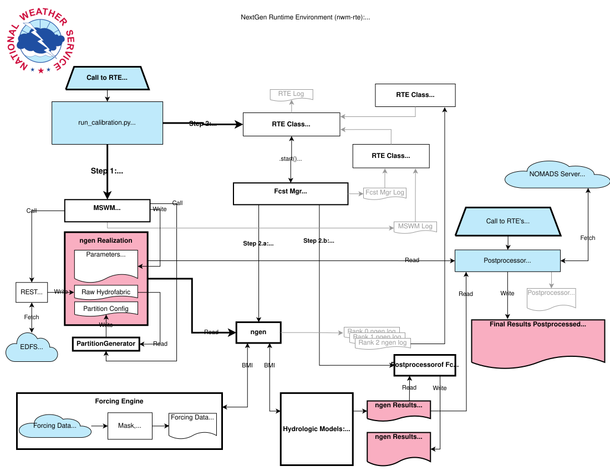

# Execution Flow

This diagram shows the RTE execution path, including realization construction, ngen execution, log parsing, and status transmission.

The optional direct interaction with ecFlow through `ecf_task_mgr` is not included in this diagram.

[Open the SVG at full resolution](execution.svg)

