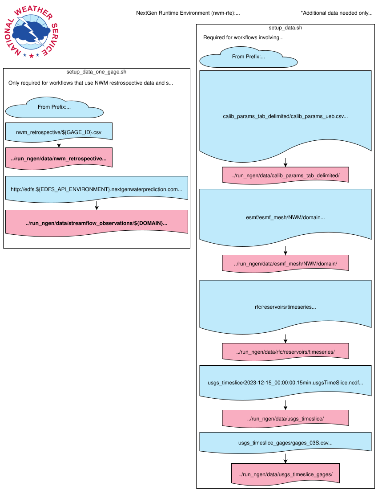

# Static Data Setup

This diagram shows the repositories, external sources, setup scripts, and local destinations involved in preparing RTE static data.

[Open the SVG at full resolution](static-data-setup.svg)

